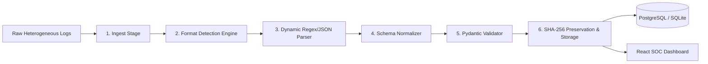

# 🛡️ ULPF — Universal Log Pre-processing Framework

<p align="center">
  
  
  
  
  
</p>

<h3 align="center">
  <b><i>"Any Log → One Standard Schema"</i></b>
</h3>

---

## 📖 Overview

**ULPF (Universal Log Pre-processing Framework)** is a modern cybersecurity platform engineered to ingest raw, unstructured, and heterogeneous logs from diverse operating systems, firewalls, and application microservices. 

It dynamically detects log formats, extracts key security attributes, normalizes data into a single unified event schema standard, computes cryptographic **SHA-256 hashes** for raw audit preservation, and indexes the results for real-time SOC security operations.

---

## 🌐 Live Deployments & Repository Links

- 🔗 **GitHub Repository**: [vgnanasekaran007-hub/ULPF](https://github.com/vgnanasekaran007-hub/ULPF)
- ⚡ **Live Production Backend**: `https://ulpf-production.up.railway.app`
- 📚 **Live API Swagger Docs**: `https://ulpf-production.up.railway.app/docs`

---

## ⚡ Core Features & Key Innovations

- 🧠 **Dynamic Format Detection**: Automatically identifies Linux `syslog/auth.log`, Windows Event Logs (Event ID 4625, 4624, 1102), Firewall Syslog (Fortinet/Cisco key-value pairs), and JSON microservice payloads.
- 📐 **Unified Schema Normalization**: Standardizes all incoming log types into one consistent 9-attribute event schema.
- 🔒 **Cryptographic Preservation**: Computes immutable **SHA-256 raw log hashes** linked 1-to-1 with unique Event IDs (`EVT-XXXXXX`) to prevent log tampering.
- 📥 **CSV Data Export**: Single-click export of normalized security events directly to CSV files from the Dashboard, Search table, or Event Drawer.
- ⏱️ **Sub-2ms Processing**: High-throughput parsing pipeline processing events in `< 2.0 ms` per log.
- 🛡️ **Multi-Event Type Engine**: Standardizes across **ALL** cybersecurity event categories:
  - `authentication_failure` & `authentication_success`
  - `privilege_escalation` (`sudo` root execution)
  - `security_audit_log_cleared` (Windows Event 1102)
  - `network_traffic_deny` (Firewall packet drops)
  - `vpn_tunnel_connected` (Remote access IPsec VPN)
  - `database_connection_timeout` (Microservice pool errors)
  - `api_rate_limit_exceeded` (API Gateway thresholds)

---

## 🏗️ System Architecture



---

## 💎 Unified Common Schema Standard

Regardless of the incoming log format (Linux, Windows, Firewall, JSON), ULPF normalizes the output into this unified schema:

```json
{
  "event_id": "EVT-89A1F2",
  "timestamp": "2026-08-31T14:22:19Z",
  "event_type": "authentication_failure",
  "source": "Linux",
  "user": "admin",
  "source_ip": "192.168.1.10",
  "severity": "high",
  "parser_id": "linux_auth_v1",
  "raw_log_hash": "8f4e2b10a99c8321045b81a7741029c38174201948d0a92841029e8471029a81",
  "status": "processed",
  "confidence": 0.98,
  "processing_time_ms": 1.4
}
```

---

## 📂 Project Structure

```text
ULPF/
├── backend/                   # FastAPI Python Backend Service
│   ├── app/
│   │   ├── main.py            # FastAPI Application Entrypoint & Startup Seeding
│   │   ├── config.py          # Environment Variables & Settings
│   │   ├── database.py        # SQLAlchemy Database Engine (SQLite / PostgreSQL)
│   │   ├── models.py          # DB ORM Models (RawEvent, NormalizedEvent, Parser)
│   │   ├── api/               # Router Endpoints (/logs, /events, /dashboard, /parsers)
│   │   ├── services/          # Log Processor & Format Detector Engines
│   │   ├── parsers/           # Linux, Windows, Firewall, and JSON Parsers
│   │   └── schemas/           # Pydantic Schemas
│   ├── requirements.txt
│   └── Dockerfile
│
├── frontend/                  # React + Vite + Tailwind CSS SOC Frontend
│   ├── src/
│   │   ├── components/        # Sidebar, Topbar, Pipeline, EventTable, EventDrawer
│   │   ├── pages/             # Dashboard, LogProcessing, Events, ParserRegistry
│   │   ├── services/          # Axios API Client & Simulation Fallback Engine
│   │   ├── utils/             # CSV Exporter Utility
│   │   ├── sampleData.js      # Heterogeneous Sample Logs & Initial State
│   │   ├── App.jsx            # Main Router
│   │   └── main.jsx
│   ├── vercel.json            # Vercel SPA Routing Configuration
│   ├── package.json
│   └── vite.config.js
│
├── sample_logs/               # Real Log Samples for Testing
│   ├── linux_auth.log
│   ├── windows_sec.log
│   ├── firewall.log
│   └── app_json.json
├── docker-compose.yml         # Full Local Stack Container Orchestration
├── .env.example               # Environment Variables Template
└── README.md
```

---

## ⚡ Quickstart & Local Setup

### Option 1: Docker Compose (Full Stack)
```bash
docker-compose up --build
```
- **Frontend App**: `http://localhost:3000`
- **Backend Swagger Docs**: `http://localhost:8000/docs`

### Option 2: Local Development

#### 1. Start FastAPI Backend
```bash
cd backend
pip install -r requirements.txt
uvicorn app.main:app --host 0.0.0.0 --port 8000 --reload
```

#### 2. Start React Frontend
```bash
cd frontend
npm install
npm run dev
```
Open **`http://localhost:5173`** in your browser.

---

## 🌐 Production Deployment Guide

### Deploy Backend to **Railway**
1. Create new project on [Railway.app](https://railway.app) from GitHub repo `vgnanasekaran007-hub/ULPF`.
2. Set **Root Directory**: `backend`
3. Set **Start Command**: `uvicorn app.main:app --host 0.0.0.0 --port $PORT`
4. Set Environment Variables:
   - `ENVIRONMENT` = `production`
   - `CORS_ORIGINS` = `*`
   - `DATABASE_URL` = `sqlite:///./ulpf.db`
5. Generate Public Domain in Railway Networking.

### Deploy Frontend to **Vercel** or **Render**
1. Create new project on [Vercel.com](https://vercel.com) from GitHub repo `vgnanasekaran007-hub/ULPF`.
2. Set **Root Directory**: `frontend`
3. Set **Build Command**: `npm run build`
4. Set **Output Directory**: `dist`
5. Set Environment Variable:
   - `VITE_API_BASE_URL` = `https://ulpf-production.up.railway.app/api`

---

## 📄 License

This project is licensed under the MIT License — see the [LICENSE](LICENSE) file for details.
