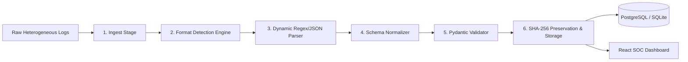

<div align="center">

# 🛡️ ULPF — Universal Log Pre-processing Framework

---

[](https://ulpf.vercel.app/)
[](https://ulpf-production.up.railway.app)
[](https://ulpf-production.up.railway.app/docs)
[](https://ulpf.vercel.app/)
[](https://ulpf.vercel.app/)
[](LICENSE)

> **ULPF (Universal Log Pre-processing Framework)** is a high-performance cybersecurity platform designed to ingest raw, heterogeneous logs from diverse operating systems, firewalls, and application microservices, dynamically detect formats, normalize data into one common event schema standard, compute cryptographic **SHA-256 hashes**, and preserve raw log audit integrity.
</div>

---

## ⚡ Core Features & Key Innovations

- 🧠 **Dynamic Format Detection**: Automatically identifies Linux `syslog/auth.log`, Windows Event Logs (Event ID 4625, 4624, 1102), Firewall Syslog (Fortinet/Cisco key-value pairs), and JSON microservice payloads.
- 📐 **Unified Schema Normalization**: Standardizes all incoming log types into one consistent 9-attribute event schema.
- 🔒 **Cryptographic Preservation**: Computes immutable **SHA-256 raw log hashes** linked 1-to-1 with unique Event IDs (`EVT-XXXXXX`) to prevent log tampering.
- 📥 **CSV Data Export**: Single-click export of normalized security events directly to CSV files from the Dashboard, Search table, or Event Drawer.
- ⏱️ **Sub-2ms Processing**: High-throughput parsing pipeline processing events in `< 2.0 ms` per log.
- 🛡️ **Multi-Event Type Engine**: Standardizes across **ALL** cybersecurity event categories:
  - `authentication_failure` & `authentication_success`
  - `privilege_escalation` (`sudo` root execution)
  - `security_audit_log_cleared` (Windows Event 1102)
  - `network_traffic_deny` (Firewall packet drops)
  - `vpn_tunnel_connected` (Remote access IPsec VPN)
  - `database_connection_timeout` (Microservice pool errors)
  - `api_rate_limit_exceeded` (API Gateway thresholds)

---

## 🏗️ System Pipeline Architecture



---

## 💎 Unified Common Schema Standard

Regardless of the incoming log format (Linux, Windows, Firewall, JSON), ULPF normalizes the output into this unified schema:

```json
{
  "event_id": "EVT-89A1F2",
  "timestamp": "2026-08-31T14:22:19Z",
  "event_type": "authentication_failure",
  "source": "Linux",
  "user": "admin",
  "source_ip": "192.168.1.10",
  "severity": "high",
  "parser_id": "linux_auth_v1",
  "raw_log_hash": "8f4e2b10a99c8321045b81a7741029c38174201948d0a92841029e8471029a81",
  "status": "processed",
  "confidence": 0.98,
  "processing_time_ms": 1.4
}
```

---

## 📂 Project Structure

```text
ULPF/
├── backend/                   # FastAPI Python Backend Service
│   ├── app/
│   │   ├── main.py            # FastAPI Application Entrypoint & Startup Seeding
│   │   ├── config.py          # Environment Variables & Settings
│   │   ├── database.py        # SQLAlchemy Database Engine (SQLite / PostgreSQL)
│   │   ├── models.py          # DB ORM Models (RawEvent, NormalizedEvent, Parser)
│   │   ├── api/               # Router Endpoints (/logs, /events, /dashboard, /parsers)
│   │   ├── services/          # Log Processor & Format Detector Engines
│   │   ├── parsers/           # Linux, Windows, Firewall, and JSON Parsers
│   │   └── schemas/           # Pydantic Schemas
│   ├── requirements.txt
│   └── Dockerfile
│
├── frontend/                  # React + Vite + Tailwind CSS SOC Frontend
│   ├── src/
│   │   ├── components/        # Sidebar, Topbar, Pipeline, EventTable, EventDrawer
│   │   ├── pages/             # Dashboard, LogProcessing, Events, ParserRegistry
│   │   ├── services/          # Axios API Client & Simulation Fallback Engine
│   │   ├── utils/             # CSV Exporter Utility
│   │   ├── sampleData.js      # Heterogeneous Sample Logs & Initial State
│   │   ├── App.jsx            # Main Router
│   │   └── main.jsx
│   ├── vercel.json            # Vercel SPA Routing Configuration
│   ├── package.json
│   └── vite.config.js
│
├── sample_logs/               # Real Log Samples for Testing
│   ├── linux_auth.log
│   ├── windows_sec.log
│   ├── firewall.log
│   └── app_json.json
├── docker-compose.yml         # Full Local Stack Container Orchestration
├── .env.example               # Environment Variables Template
└── README.md
```


## 📄 License

This project is licensed under the MIT License — see the [LICENSE](LICENSE) file for details.

<div align="center">

## 👨‍💻 Developed by

**Gnanasekaran V**

[](https://github.com/vgnanasekaran007-hub)
[](mailto:vgnanasekaran007@gmail.com)
[](https://meta-shield-eight.vercel.app/)

---

Made with ❤️ using Flask · Pillow · Bootstrap 5 · Chart.js · Leaflet.js

⭐ **Star this repo** if you found it useful!!!

</div


⭐ **Star this repo** if you found it useful!!!
